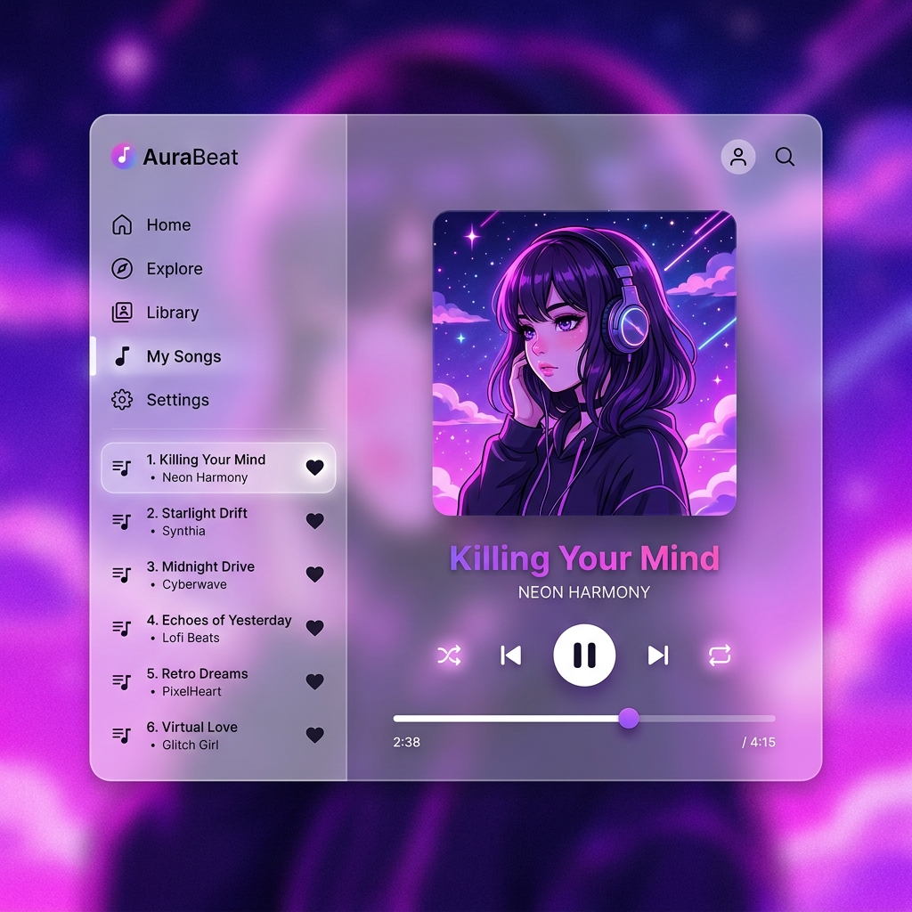

# 🎵 AuraBeat

AuraBeat is a stunning, premium web-based music player featuring an "Apple Music"-style frosted glass interface, dynamic vibrant backgrounds, and a full suite of features including custom playlists, favorites, and live song lyrics.

 <!-- Update this with a real screenshot later! -->

## ✨ Features

- **Premium Frosted Glass UI:** Dynamic backgrounds that blur and pull colors from the currently playing album artwork.
- **Light & Dark Modes:** Seamlessly switch between a vibrant light mode and a deep, immersive cyberpunk dark mode.
- **Custom Playlists:** Create playlists, add songs, and organize your music library.
- **Favorites System:** One-click inline heart buttons to instantly add songs to your "Top Favorites".
- **Live Visualizer & Animations:** Real-time audio visualizer and rotating vinyl album art.
- **Lyrics & Comments:** Built-in side panel to view lyrics and leave comments on tracks.

## 🚀 Tech Stack

- **Frontend:** HTML5, Vanilla JavaScript, CSS3 (No external frameworks for maximum performance)
- **Backend:** PHP
- **Database:** MySQL
- **Caching:** Service Worker (Network-first strategy for instant loading)

## 🛠️ Setup Instructions

To run AuraBeat locally using XAMPP or any standard LAMP/WAMP stack:

1. **Clone the repository** into your `htdocs` or `www` directory:
   ```bash
   git clone https://github.com/Nudj21/AuraBeat.git
   ```
2. **Setup the Database:**
   - Open phpMyAdmin or your MySQL console.
   - Create a database named `music_playlist_db`.
   - Run the provided `db_upgrade_script.php` and `db_favorites_setup.php` scripts to automatically generate the necessary tables (users, songs, playlists, user_favorites, etc.).
3. **Configure the Application:**
   - Open `api/db_connect.php` and ensure your database credentials match your local setup (default is `root` with no password for XAMPP).
4. **Run the Application:**
   - Open your browser and navigate to `http://localhost/AURABEAT/`

## 📝 License

This project is open-source and available under the [MIT License](LICENSE).
